# Crypto-ResNet with FHE

> [中文文档](README.md) ｜ [GitHub](https://github.com/Pro1eta/crypto-resnet-with-fhe)

Fully Homomorphic Encryption (FHE) inference for ResNet architectures (32, 56, 110) using [OpenFHE](https://github.com/openfheorg/openfhe-development).

This project implements low-complexity deep convolutional neural network inference over encrypted data, leveraging multiplexed parallel convolutions to enable practical FHE-based image classification with ResNet-family models.

## Reference

This implementation is based on:

> E. Lee, J.-W. Lee, J. Lee, Y.-S. Kim, Y. Kim, and J.-S. No,  
> "Low-Complexity Deep Convolutional Neural Networks on Fully Homomorphic Encryption Using Multiplexed Parallel Convolutions,"  
> *ICML 2022*. [Paper](https://proceedings.mlr.press/v162/lee22e.html)

### Library

Built on [OpenFHE](https://github.com/openfheorg/openfhe-development) — an open-source FHE library supporting BGV, BFV, CKKS, and other schemes.

> A. Al Badawi et al., "OpenFHE: Open-Source Fully Homomorphic Encryption Library," *WAHC 2022*.

## Prerequisites

- C++17 or later
- CMake 3.16+
- [OpenFHE](https://github.com/openfheorg/openfhe-development) (v1.5.1+)

## Build

```bash
# Configure
cmake -B build -S .

# With local source-built OpenFHE (no "make install" performed)
cmake -B build -S . -DOPENFHE_BUILD_DIR=/path/to/openfhe/build

# Compile
cmake --build build -j$(nproc)

# Clean rebuild
rm -rf build && cmake -B build -S . && cmake --build build -j$(nproc)
```

If OpenFHE is installed system-wide (`make install`), omit `-DOPENFHE_BUILD_DIR`.

## Architecture

The network follows the RNS-CKKS FHE architecture proposed in the ICML 2022 paper, using multiplexed parallel convolutions, imaginary-removing bootstrapping, and approximate ReLU.

```mermaid
flowchart TD
    subgraph Initial["Initial Layer"]
        ct_A["ct_A (32×32×3)"] --> ConvBN1["ConvBN1<br/>3×3, s=1, 3→16"]
        ConvBN1 --> ReLU1["AppReLU"]
    end

    ReLU1 --> S2_in

    subgraph S2["Stage 2 (16ch, 32×32, ki=1) - Boot14"]
        direction TB
        S2_in["Input"]
        subgraph B2["Block × n"]
            C2a["ConvBN2_xa<br/>3×3, s=1, 16→16"] --> Boot2a["Boot14"]
            Boot2a --> ReLU2a["AppReLU"]
            ReLU2a --> C2b["ConvBN2_xb<br/>3×3, s=1, 16→16"]
            C2b --> Add2["(+)"]
            Add2 --> Boot2b["Boot14"]
            Boot2b --> ReLU2b["AppReLU"]
        end
        S2_in --> C2a
        S2_in -- "Identity Skip" --> Add2
    end

    ReLU2b --> S3_in

    subgraph S3["Stage 3 (16→32ch, 32→16, ki=1→2) - Boot13"]
        direction TB
        S3_in["Input"]
        subgraph B3_1["Block 1 (downsample)"]
            C3_1a["ConvBN3_1a<br/>3×3, s=2, 16→32"] --> B3_1a["Boot13"]
            B3_1a --> R3_1a["AppReLU"]
            R3_1a --> C3_1b["ConvBN3_1b<br/>3×3, s=1, 32→32"]
            C3_1b --> Add3_1["(+)"]
            Add3_1 --> B3_1b["Boot13"]
            B3_1b --> R3_1b["AppReLU"]
        end

        DS1["ConvBN_s1 / Downsamp1<br/>1×1, s=2, 16→32"] --> Add3_1
        S3_in --> C3_1a
        S3_in -- "Downsample Skip" --> DS1

        R3_1b --> B3_n_in(("·"))

        subgraph B3_n["Block 2~n (identity)"]
            C3_na["ConvBN3_xa<br/>3×3, s=1, 32→32"] --> B3_na["Boot13"]
            B3_na --> R3_na["AppReLU"]
            R3_na --> C3_nb["ConvBN3_xb<br/>3×3, s=1, 32→32"]
            C3_nb --> Add3_n["(+)"]
            Add3_n --> B3_nb["Boot13"]
            B3_nb --> R3_nb["AppReLU"]
        end

        B3_n_in --> C3_na
        B3_n_in -- "Identity Skip" --> Add3_n
    end

    R3_nb --> S4_in

    subgraph S4["Stage 4 (32→64ch, 16→8, ki=2→4) - Boot12"]
        direction TB
        S4_in["Input"]
        subgraph B4_1["Block 1 (downsample)"]
            C4_1a["ConvBN4_1a<br/>3×3, s=2, 32→64"] --> B4_1a["Boot12"]
            B4_1a --> R4_1a["AppReLU"]
            R4_1a --> C4_1b["ConvBN4_1b<br/>3×3, s=1, 64→64"]
            C4_1b --> Add4_1["(+)"]
            Add4_1 --> B4_1b["Boot12"]
            B4_1b --> R4_1b["AppReLU"]
        end

        DS2["ConvBN_s2 / Downsamp2<br/>1×1, s=2, 32→64"] --> Add4_1
        S4_in --> C4_1a
        S4_in -- "Downsample Skip" --> DS2

        R4_1b --> B4_n_in(("·"))

        subgraph B4_n["Block 2~n (identity)"]
            C4_na["ConvBN4_xa<br/>3×3, s=1, 64→64"] --> B4_na["Boot12"]
            B4_na --> R4_na["AppReLU"]
            R4_na --> C4_nb["ConvBN4_xb<br/>3×3, s=1, 64→64"]
            C4_nb --> Add4_n["(+)"]
            Add4_n --> B4_nb["Boot12"]
            B4_nb --> R4_nb["AppReLU"]
        end

        B4_n_in --> C4_na
        B4_n_in -- "Identity Skip" --> Add4_n
    end

    R4_nb --> Head["AvgPool → FC → Ciphertext output (10-dim)"]
```



### Block counts per architecture

| Model     | Blocks per stage | Total layers |
|-----------|:-----------------:|:------------:|
| ResNet-20 | 3                 | 20           |
| ResNet-32 | 5                 | 32           |
| ResNet-56 | 9                 | 56           |
| ResNet-110| 18                | 110          |

### Key components

- **ConvBN**: Fused multiplexed parallel convolution + batch normalization (Algorithm 7 in the paper)
- **AppReLU**: Approximate ReLU using composite minimax polynomial of degrees {15, 15, 27}
- **Boot**: Imaginary-removing bootstrapping (removes accumulated imaginary noise to prevent catastrophic divergence)
- **Downsamp**: Multiplexed parallel downsampling for stride-2 transitions
- **AvgPool + FC**: Average pooling with index rearrangement, followed by fully connected layer

## License

This project is licensed under the MIT License — see [LICENSE](LICENSE) for details.
