# FHE-ResNet

> [English](README.en.md)

使用 [OpenFHE](https://github.com/openfheorg/openfhe-development) 实现的 ResNet 系列（32、56、110）全同态加密（FHE）推理。

本项目实现了基于复用并行卷积（Multiplexed Parallel Convolutions）的低复杂度深度卷积神经网络加密数据推理，使得基于 FHE 的 ResNet 系列模型图像分类成为可能。

## 参考文献

本实现基于以下论文：

> E. Lee, J.-W. Lee, J. Lee, Y.-S. Kim, Y. Kim, and J.-S. No,  
> "Low-Complexity Deep Convolutional Neural Networks on Fully Homomorphic Encryption Using Multiplexed Parallel Convolutions,"  
> *ICML 2022*. [论文](https://proceedings.mlr.press/v162/lee22e.html)

### 依赖库

基于 [OpenFHE](https://github.com/openfheorg/openfhe-development) 构建——一个支持 BGV、BFV、CKKS 等方案的开源 FHE 库。

> A. Al Badawi et al., "OpenFHE: Open-Source Fully Homomorphic Encryption Library," *WAHC 2022*.

## 环境要求

- C++17 或更高版本
- CMake 3.16+
- [OpenFHE](https://github.com/openfheorg/openfhe-development) (v1.5.1)

## 构建

```bash
# 配置
cmake -B build -S .

# 本地源树构建的 OpenFHE（未 make install）
cmake -B build -S . -DOPENFHE_BUILD_DIR=/path/to/openfhe/build

# 编译
cmake --build build -j$(nproc)

# 清除后重新编译
rm -rf build && cmake -B build -S . && cmake --build build -j$(nproc)
```

如果 OpenFHE 已通过 `make install` 安装到系统路径，可省略 `-DOPENFHE_BUILD_DIR`。

## 网络架构

网络遵循 ICML 2022 论文中提出的 RNS-CKKS FHE 架构，使用复用并行卷积、虚部去除自举和近似 ReLU。

```mermaid
flowchart TD
    subgraph Initial["初始层"]
        ct_A["ct_A (32×32×3)"] --> ConvBN1["ConvBN1<br/>3×3, s=1, 3→16"]
        ConvBN1 --> ReLU1["AppReLU"]
    end

    ReLU1 --> S2_in

    subgraph S2["第二阶段 (16ch, 32×32, ki=1) - Boot14"]
        direction TB
        S2_in["输入"]
        subgraph B2["Block × n"]
            C2a["ConvBN2_xa<br/>3×3, s=1, 16→16"] --> Boot2a["Boot14"]
            Boot2a --> ReLU2a["AppReLU"]
            ReLU2a --> C2b["ConvBN2_xb<br/>3×3, s=1, 16→16"]
            C2b --> Add2["(+)"]
            Add2 --> Boot2b["Boot14"]
            Boot2b --> ReLU2b["AppReLU"]
        end
        S2_in --> C2a
        S2_in -- "恒等跳跃连接" --> Add2
    end

    ReLU2b --> S3_in

    subgraph S3["第三阶段 (16→32ch, 32→16, ki=1→2) - Boot13"]
        direction TB
        S3_in["输入"]
        subgraph B3_1["第1块 (下采样)"]
            C3_1a["ConvBN3_1a<br/>3×3, s=2, 16→32"] --> B3_1a["Boot13"]
            B3_1a --> R3_1a["AppReLU"]
            R3_1a --> C3_1b["ConvBN3_1b<br/>3×3, s=1, 32→32"]
            C3_1b --> Add3_1["(+)"]
            Add3_1 --> B3_1b["Boot13"]
            B3_1b --> R3_1b["AppReLU"]
        end

        DS1["ConvBN_s1 / Downsamp1<br/>1×1, s=2, 16→32"] --> Add3_1
        S3_in --> C3_1a
        S3_in -- "下采样跳跃连接" --> DS1

        R3_1b --> B3_n_in(("·"))

        subgraph B3_n["第2~n块 (恒等)"]
            C3_na["ConvBN3_xa<br/>3×3, s=1, 32→32"] --> B3_na["Boot13"]
            B3_na --> R3_na["AppReLU"]
            R3_na --> C3_nb["ConvBN3_xb<br/>3×3, s=1, 32→32"]
            C3_nb --> Add3_n["(+)"]
            Add3_n --> B3_nb["Boot13"]
            B3_nb --> R3_nb["AppReLU"]
        end

        B3_n_in --> C3_na
        B3_n_in -- "恒等跳跃连接" --> Add3_n
    end

    R3_nb --> S4_in

    subgraph S4["第四阶段 (32→64ch, 16→8, ki=2→4) - Boot12"]
        direction TB
        S4_in["输入"]
        subgraph B4_1["第1块 (下采样)"]
            C4_1a["ConvBN4_1a<br/>3×3, s=2, 32→64"] --> B4_1a["Boot12"]
            B4_1a --> R4_1a["AppReLU"]
            R4_1a --> C4_1b["ConvBN4_1b<br/>3×3, s=1, 64→64"]
            C4_1b --> Add4_1["(+)"]
            Add4_1 --> B4_1b["Boot12"]
            B4_1b --> R4_1b["AppReLU"]
        end

        DS2["ConvBN_s2 / Downsamp2<br/>1×1, s=2, 32→64"] --> Add4_1
        S4_in --> C4_1a
        S4_in -- "下采样跳跃连接" --> DS2

        R4_1b --> B4_n_in(("·"))

        subgraph B4_n["第2~n块 (恒等)"]
            C4_na["ConvBN4_xa<br/>3×3, s=1, 64→64"] --> B4_na["Boot12"]
            B4_na --> R4_na["AppReLU"]
            R4_na --> C4_nb["ConvBN4_xb<br/>3×3, s=1, 64→64"]
            C4_nb --> Add4_n["(+)"]
            Add4_n --> B4_nb["Boot12"]
            B4_nb --> R4_nb["AppReLU"]
        end

        B4_n_in --> C4_na
        B4_n_in -- "恒等跳跃连接" --> Add4_n
    end

    R4_nb --> Head["AvgPool → FC → 密文输出 (10维)"]
```



### 各架构块数量

| 模型       | 每阶段块数 | 总层数 |
|-----------|:---------:|:-----:|
| ResNet-20 | 3         | 20    |
| ResNet-32 | 5         | 32    |
| ResNet-56 | 9         | 56    |
| ResNet-110| 18        | 110   |

### 关键组件

- **ConvBN**：融合的复用并行卷积 + 批归一化（论文算法 7）
- **AppReLU**：使用度数 {15, 15, 27} 的复合极小极大多项式近似的 ReLU
- **Boot**：虚部去除自举（去除累积的虚部噪声，防止灾难性发散）
- **Downsamp**：用于 stride-2 过渡的复用并行下采样
- **AvgPool + FC**：带索引重排的平均池化，后接全连接层

### 关键参数

| 参数           | 值      |
|---------------|---------|
| N (环维度)     | 2^16    |
| nt (总槽位)    | 2^15    |
| 自举槽位       | 2^14, 2^13, 2^12 |
| APR 精度 (α)   | 13      |
| 缩放因子 B     | 40      |
| 安全等级       | 128-bit |

## 许可证

本项目基于 MIT 许可证——详见 [LICENSE](LICENSE)。
